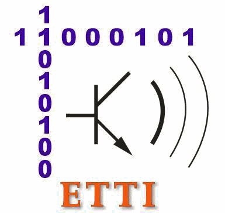

Scopul proiectului

Descrierea  con?inutului vizual de pe terminalele mobile cu ajutorul unui model de re?ea neuronala

Obiectivele propuse

Implementarea ?i antrenarea unei re?ele neuronale care va genera o descrierea textuala pe baza unei poze

Implementarea unui server care sa permita utilizarea modelului print REST API

Dezvoltarea unei aplica?ii mobile care sa comunice cu serverul

__Diagrama bloc a__  __aplicatiei__

Modelul de generare a

descrierii textuale

Structura re?elei recurente

Re?eaua de decodare este conectata la penultimul strat al VGG\-ului

Primul strat reduce vectorul de intrare de la 4096 la 512\,egalcunumarul de stari interne ale straturilor GRU

Ultimul strat va con?ine 10000 de elemente=dimensiunea vocabularului re?elei

Vectorul de ie?ire reprezinta o codare de tipone\-hot ?i\,folosind harta detokenizare\, determinamcuvântulpe baza indexului valorii maxime

Antrenarea re?elei

recurente

Pentru antrenarea modelului recurent s\-au utilizat:

Imaginile sub forma codata de penultimul strat al VGG16 \(un vector 4096 valori\)

OptimizatorRMSpropcu o rata de înva?are variabila

20 de epoci\, cu un o dimensiune a lotului de înva?are de 3000 de imagini\.

Oepocaadurataproximativ6 ore pe unprocesorgraficNvidiaGTX 1060

__Evolu?ia func?iei cost__  __pe__  __setul__  __de__  __validare__

Rezultatele modelului

Setulde validare

Implementare serverului

Autentificarefirebase

Pentru implementarea serverului ce ruleaza modelul de descriere aimagnilors\-au utilizat urmatoarele tehnologii:

Flask\(REST API\)

HTML/CSS\(Interfa?a

WEB\)

Docker\(Scalabilitate\)

Firebase\(Autentificare\,Scalabilitate\)

Google Cloud\(Hosting\)

Scalabilitate?iloadbalancing

Dockerinstances

Aplica?ia web software

Serverul are ?i o aplica?ie web ce permite utilizatorului accesul la serviciul de generare a descrierilor\.

Serverul dispune si de un serviciu de REST API catre acest serviciu

POSThttp://127\.0\.0\.1:5000/api/predict?i poza a carei descriere ne intereseaza

Aplica?ia Android

Aplica?ia android are urmatoarea structura:

Pagina de introducere

2\.  Paginile de autentificare/înregistrare

3\.  Pagina de selectare a pozei

4\.  Generarea descrierii

Proiectul de fa?a a reu?it sa atinga urmatoarele puncte:

Crearea unui model capabil sa genereze o descriere textuala pe baza unei imagini

Antrenarea ?i testarea modelului de re?ea neuronala

Implementarea modelului într\-un back\-endscalabil\,capabil sa faca fa?a cererii utilizatorilor

Crearea unei aplica?ii web care sa permita utilizarea aplica?iei prin intermediul unui browser web

Implementarea unei aplica?ii android cu un serviciu de autentificare ?i gestiune al utilizatorilor ce comunica cu serverul web pentru a genera descrierile imaginilor

Testarea aplica?iei in diferite scenarii

