# Caption this

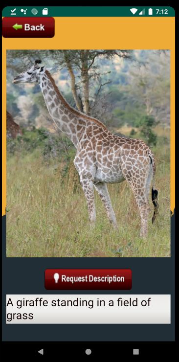

Scopul proiectului

Descrierea  continutului vizual de pe terminalele mobile cu ajutorul unui model de retea neuronala

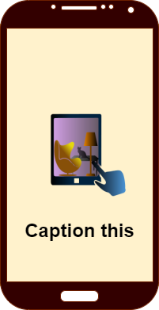

Obiectivele propuse

Implementarea si antrenarea unei retele neuronale care va genera o descrierea textuala pe baza unei poze

Implementarea unui server care sa permita utilizarea modelului print REST API

Dezvoltarea unei aplicatii mobile care sa comunice cu serverul

__Diagrama bloc a__  __aplicatiei__

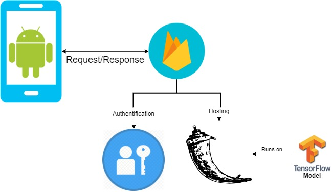

Modelul de generare a

descrierii textuale

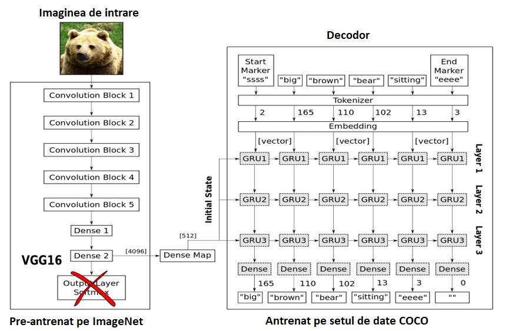

Structura retelei recurente

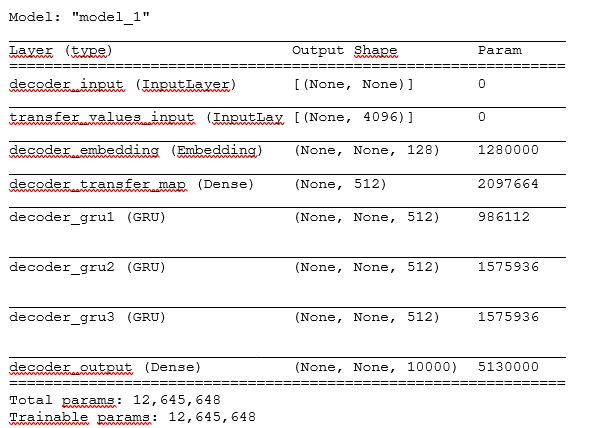

Reteaua de decodare este conectata la penultimul strat al VGG\-ului

Primul strat reduce vectorul de intrare de la 4096 la 512\,egalcunumarul de stari interne ale straturilor GRU

Ultimul strat va contine 10000 de elemente=dimensiunea vocabularului retelei

Vectorul de iesire reprezinta o codare de tipone\-hot si\,folosind harta detokenizare\, determinamcuvântulpe baza indexului valorii maxime

Antrenarea retelei

recurente

Pentru antrenarea modelului recurent s\-au utilizat:

Imaginile sub forma codata de penultimul strat al VGG16 \(un vector 4096 valori\)

OptimizatorRMSpropcu o rata de învatare variabila

20 de epoci\, cu un o dimensiune a lotului de înva?are de 3000 de imagini\.

Oepocaadurataproximativ6 ore pe unprocesorgraficNvidiaGTX 1060

__Evolu?ia func?iei cost__  __pe__  __setul__  __de__  __validare__

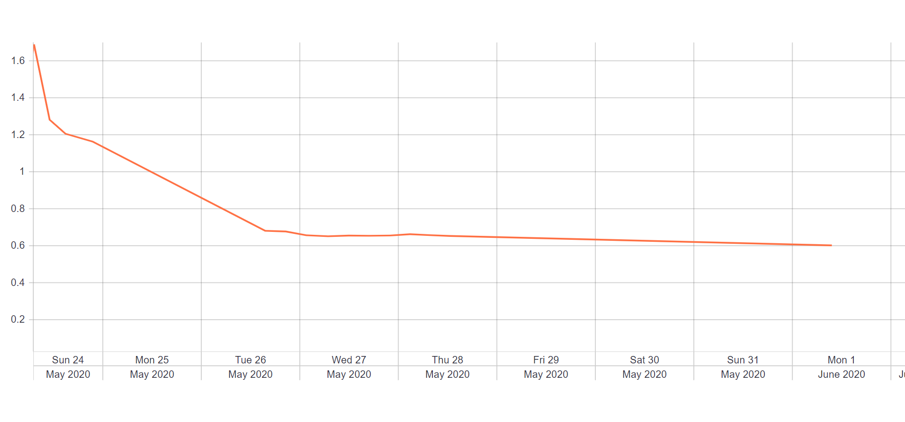

Rezultatele modelului

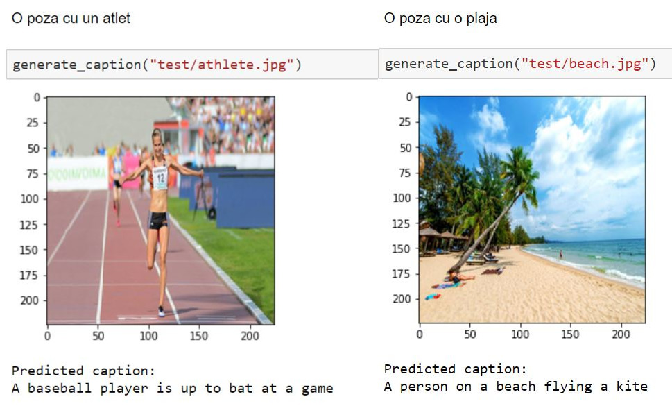

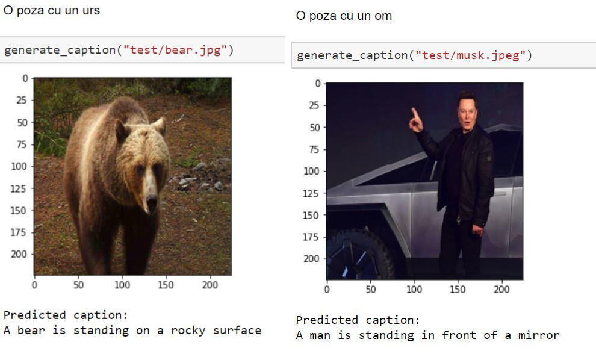

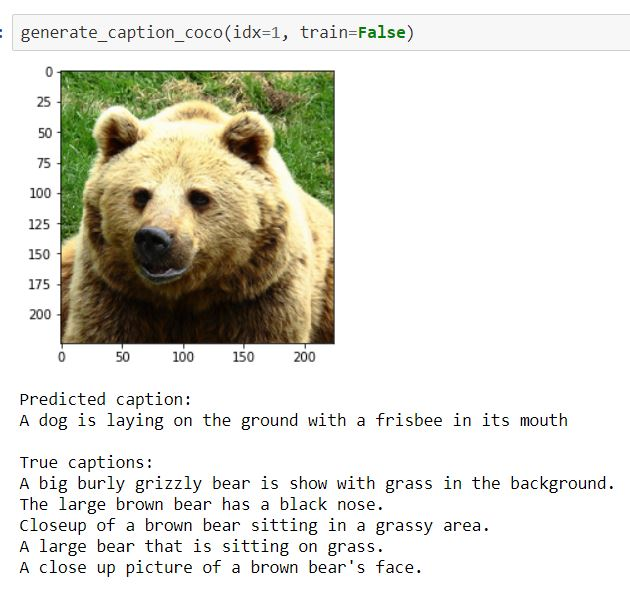

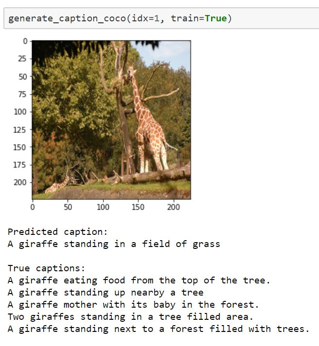

Setulde validare

Implementare serverului

Autentificarefirebase

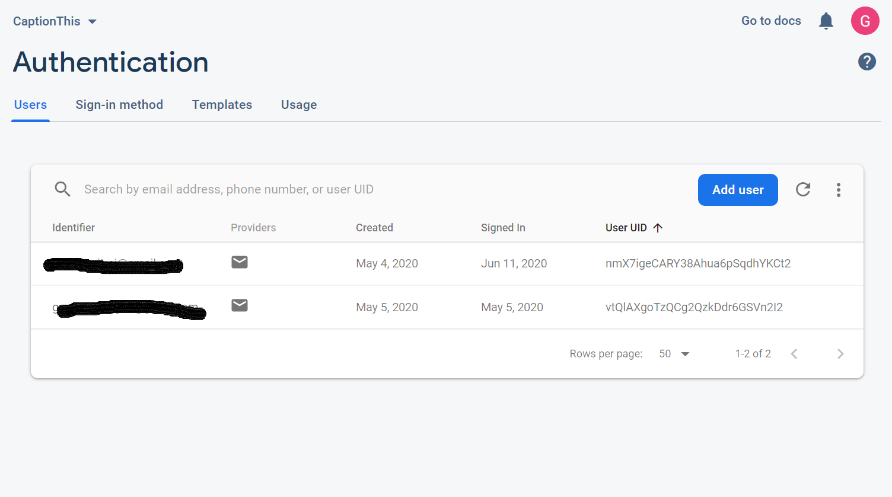

Pentru implementarea serverului ce ruleaza modelul de descriere aimagnilors\-au utilizat urmatoarele tehnologii:

Flask\(REST API\)

HTML/CSS\(Interfa?a

WEB\)

Docker\(Scalabilitate\)

Firebase\(Autentificare\,Scalabilitate\)

Google Cloud\(Hosting\)

Scalabilitate?iloadbalancing

Dockerinstances

Aplica?ia web software

Serverul are si o aplicatie web ce permite utilizatorului accesul la serviciul de generare a descrierilor\.

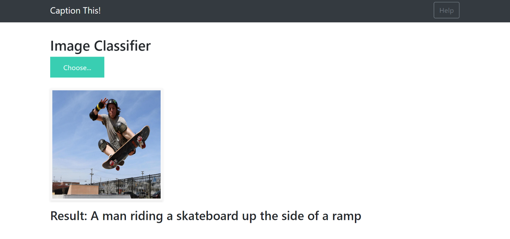

Serverul dispune si de un serviciu de REST API catre acest serviciu

POSThttp://127\.0\.0\.1:5000/api/predict si poza a carei descriere ne intereseaza

Aplicatia Android

Aplicatia android are urmatoarea structura:

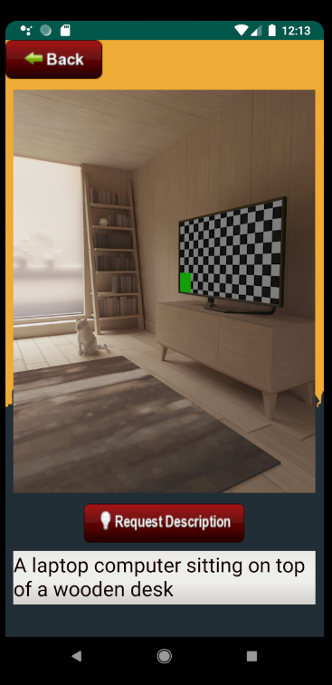

Pagina de introducere

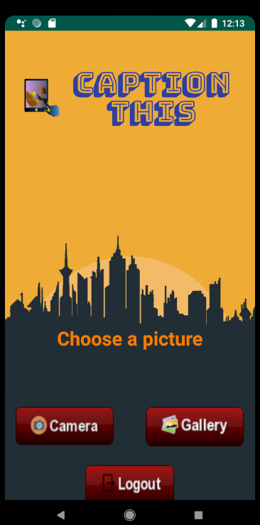

Paginile de autentificare/înregistrare

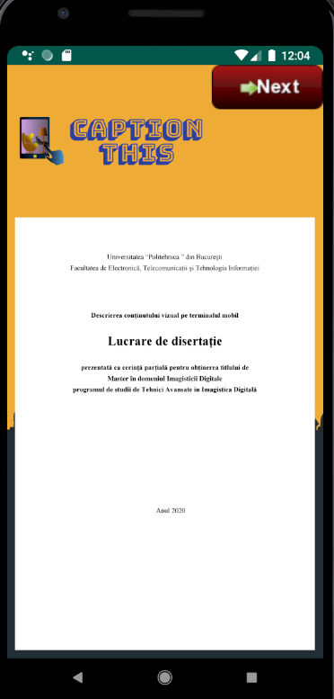

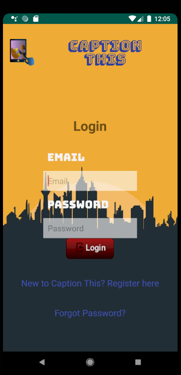

Pagina de selectare a pozei

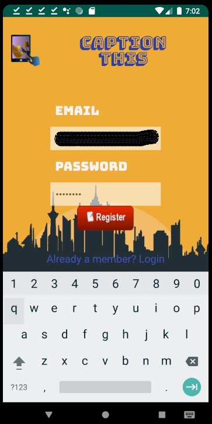

Generarea descrierii

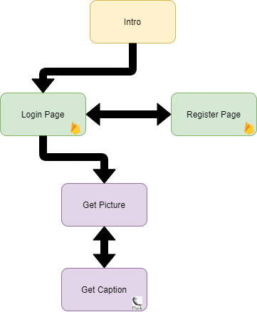

# Concluzii

Proiectul de fata a reusit sa atinga urmatoarele puncte:

Crearea unui model capabil sa genereze o descriere textuala pe baza unei imagini

Antrenarea si testarea modelului de retea neuronala

Implementarea modelului într\-un back\-endscalabil\,capabil sa faca fata cererii utilizatorilor

Crearea unei aplicatii web care sa permita utilizarea aplicatiei prin intermediul unui browser web

Implementarea unei aplicatii android cu un serviciu de autentificare si gestiune al utilizatorilor ce comunica cu serverul web pentru a genera descrierile imaginilor

Testarea aplicatiei in diferite scenarii

